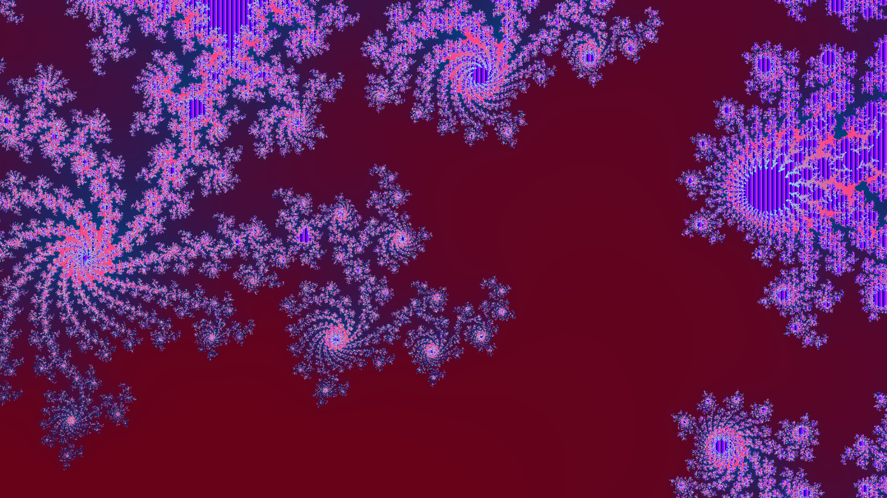

# Mandelbrot Set

## Introduction
Like an every true programmer who respects himself, I tried to paint Mandelbrot set and spend many hours on experiments with colours. 
First version of programm was too slow, so I decided to upgrade it using intrinsics. 
As a result, it is working really fast now, so I can use it when I want to draw something interesting with fractals.

## Main information
This program creates [Mandelbrot set](https://en.wikipedia.org/wiki/Mandelbrot_set) using Glut, SSE and AVX intrinsics.

## Controls:

* Left/Right, Up/Down -- movement
* A/Z -- change scale 
* K/M -- stretch and squeeze horizontally
* I/O -- stretch and squeeze vertically
* F -- full screen mode
* C -- window mode (default)
* Esc -- quit